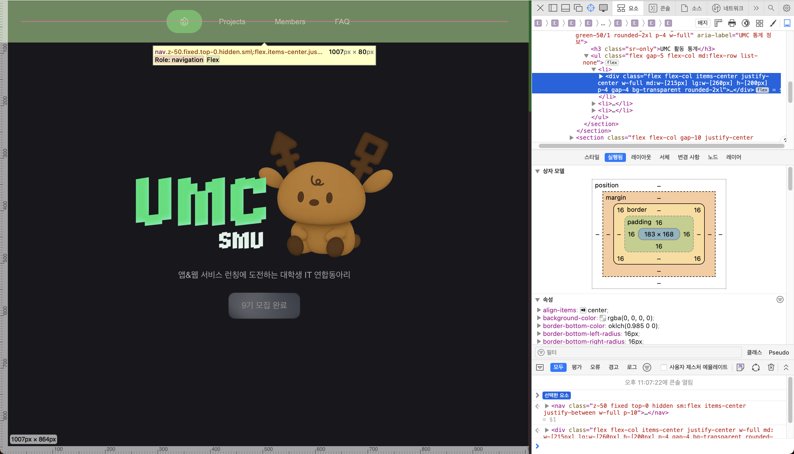

# 미션1: 상명대학교 UMC 사이트 Semantic Tag 구조 분석

> **주제**: Semantic Tag를 활용하여 상명대학교 UMC 웹사이트를 구조 분해한 결과입니다.  
> 각 화면을 열어 구조 분해한 이미지를 첨부하였습니다.

---

## 1. 메인 화면

🔗 [메인 페이지 바로가기](https://www.smumc.co.kr/)

---

## 2. 프로젝트 화면

🔗 [프로젝트 페이지 바로가기](https://www.smumc.co.kr/projects)

---

## 3. 멤버 화면

🔗 [멤버 페이지 바로가기](https://www.smumc.co.kr/members)

- 멤버 구조 분석 (1)

- 멤버 구조 분석 (2)

---

## 4. 안내 화면 (FAQ)

🔗 [안내 페이지 바로가기](https://www.smumc.co.kr/notice)

---

## 5. 찾을 수 없는 페이지 (404 Not Found)

🔗 [404 페이지 바로가기](https://www.smumc.co.kr/not-found)

---

## 📌 정리

- Semantic Tag (`<header>`, `<nav>`, `<main>`, `<section>`, `<article>`, `<footer>` 등)를 실제 웹사이트 구조와 매칭하여 시각적으로 분석.
- 각 페이지의 레이아웃 및 시맨틱 태그 사용 방식을 확인 가능.
